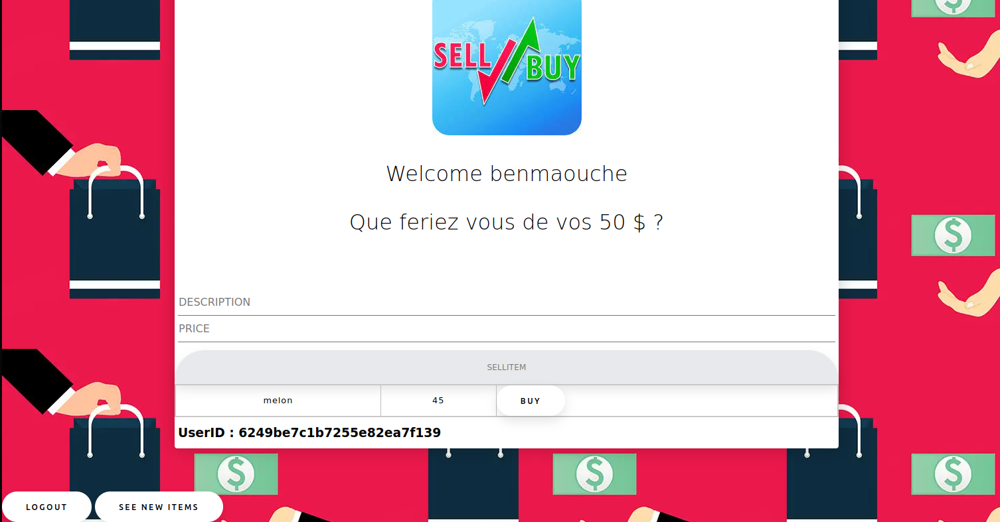

#### SELLYOURSAPP
- Ce tp permet une mise en pratqiue de plusieurs notions vues durant les seances de cours et de tp,en l'ocurrence MongoDb(gestion des bases de données),Serveur Express(gestion de connexion serveur,client,organisation en routes,Middlewares) ainsi que Fetch. 
- l'application reprends les standards de la vente en ligne, differentes simulations de vente et achat peuvent etre réalisées à travers cette application.


 1. #### Recupertation du projet :
 l'éxécution de la commande suivante est nécessaire pour pouvoir récupérer ce projet:
 ```bash
git clone https://gitlab-etu.fil.univ-lille1.fr/benmaouche/l3g7-jsfs.git
```
2. #### Réalisation du TP:
- Afin de réaliser ce travail, je me suis appuyé principalement sur ce qui se trouvait dans l'énoncé comme indications et informatios,je me suis notamment inspiré du code mis à notre disposition sur GIT.
- Toutes les questions ont été traité sans y avoir rencontré de diffciculté majeure. 

3. #### Exécution et affichage des résultats:
- Il est nécesaire de générer le package node_modules contenant toutes les dependances de node en éxécutant la commande ci-dessous avant toute manipulation des fichiers contenus dans ce deopt :
 ```bash
npm install
```
- une fois la commande exécutée, il est fortement conseillé de suivre les étapes et instructions dans l'ordre
1. ###  Lancer le serveur Mongodb:
 - afin de lancer le serveur Mongodb, le suivi de ces instructions est indispensable:
  - il faudra en premier lieu créer un dossier dbData ou seront stockées les données relatives aux bases de données et collections qu'on a crée à l'aide de la commande suivante:
   ```bash
mkdir dbData
```
- une fois le dossier dbdata créé on éxecutera la commande suivante:
 ```bash
mongod --dbpath dbData
```
2. ### Lancer le serveur Web:
- une fois tous les fichiers indispensable au bon fonctionnement de notre code réunis au sein de notre répértoire, on se positionne à la source(au niveau du répértoire application_name) et on fait fonctionner notre serveur à l'aide de la commande suivante:
 ```bash
 nodemon
```
- afin de s'assurer du bon fonctionnement de notre code,on suit le lien ci dessous, ce qui permet se rendre sur la page d'accueil ou un formulaire de connexion et d'inscription sont accessibles.
 ```bash
http://localhost:3000/
```

3. ### Comment devenir Le roi du Commerce En Ligne:
- une fois sur la page, un formulaire d'authentification est présent, ou tout utilisateur déja inscrit peut accéder aux données et objets vendus par la communauté Sell&Buy, "Crééer un compte" est un lien de redirection vers une page de création de compte dans le cas ou l'utilsateur veut s'inscrire en remplissant les champs de saise mis à sa desposition avant de cliquer sur le bouton "Register"

4. #### Achat et Vente:
- l'accés aux objets mis en ventes par l'utilisateur, est possible aprés authentification (Login) avec un pseudonyme et mot de passe qui doivent etre correctes.
- arrivé sur la page d'accueil,
un message d'accueil accompagné du nom et cagnotte de l'utilsateur sont affichés, deux champs "DESCRIPTION" et "PRICE" également présents permettent à l'utilsateur de renseiger l'objet à vendre ainsi que le prix de vente voulu, l'objet ne sera mis en vente qu'une fois que l'utilsateur aurait cliqué sur le bouton SELLITEM.
- un tableau répertoriant tous les objets mis en vente qui sont renseignés par un nom ainsi qu'un prix de vente et dont l'utilisateur peut faire acquisition  en cliquant sur le bouton Buy à condition que ses moyens lui permettent de se l'offrir(l'utilsateur sera notifié de message de succés de vente,d'échec selon la situation dans laquelle il se trouve)
- pour etre à l'affut et rafrichir la liste des objets mis en ligne, le bouton SEE NEW ITEMS permet de recuperer les objets fraichement mis en vente par d'autres utilsateurs.
- La déconnexion est réalisable en cliquant sur le bouton LOGOUT. 


